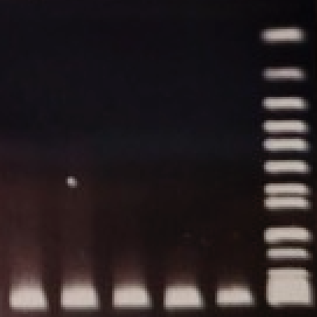

  

      <a href="#about" class="cta-button">About</a>
      <a href="#teaching" class="cta-button">Teaching</a>
      <a href="#research" class="cta-button">Research</a>
  

  <!-- Add content or text for the banner here if needed -->
      
  <h1>Welcome to the VANLAB</h1>
  
WEBSITE UNDER CONSTRUCTION

  
Genetic diversity in locally adapted and invasive plants

  

<!--[About](#About) | [Research](#Research) | [Teaching](#Teaching)-->

  

    <a href="#about">
      <!-- Use your icon image URL here -->
      
    </a>
    
About the VanLab

  

  

    <a href="#research">
      <!-- Use your icon image URL here -->
      
    </a>
    
Research Focus

  

  

    <a href="#joining-the-lab">
      <!-- Use your icon image URL here -->
      
    </a>
    
Joining the lab

  

## Acer VanWallendael

[Go to Test Page](test_page.md)

## About

The VanWallendael lab is starting up at North Carolina State University in January 2024! We are housed in the Horticulture building on main campus within the Weed Science program. Our lab's focus is on the intersection between evolutionary genetics and weed science. We collaborate widely to use evolutionary concepts to understand weed management, and to use weeds and invasive species as empirical evolutionary models. We study many aspects of weed science, using ecology, evolution, and genetics to understand large-scale ecological patterns and microevolutionary processes. 

## Research

### Weedy proso millet

A focal species for the lab is proso millet (*Panicum miliaceum*), a plant that grows both as a drought-tolerant crop, and an invasive weed in many parts of the world. We are uncovering historical diversification in this crop through population genetics and uncovering mechanisms of drought tolerance through comparative genomics. 

### Weed populations over time 

A major focus of the lab is understanding the genetic changes that occur in weed populations, and to use these to both predict emerging problem weeds and track rapid evolution in real-time. We will be establishing sites and recruiting collaborators continuously thorughout this project.

### Previous research

  My previous research focused on plant-fungal relationships and local adaptation in switchgrass at Michigan State University, as well as invasion     biology of Japanese knotweed at Fordham University.
  [Acer V. Google Scholar](https://scholar.google.com/citations?user=i8c_0TsAAAAJ&hl=en)

## Joining the lab

Please contact Dr. VanWallendael if you are interested in joining the lab! As specific funded positions come available, we will post them here. 

## Teaching

At NCSU I am teaching Weed Biology ([CS 716](https://wolfware.ncsu.edu/courses/details/?sis_id=SIS:2024:1:1:CS:716:001)) each spring. 

## Contact 

Dr. VanWallendael can be contacted at:
<a href="vanwaax07@gmail.com">vanwaax07@gmail.com</a>

Lab code can be found on [Github](https://github.com/avanwallendael/)

